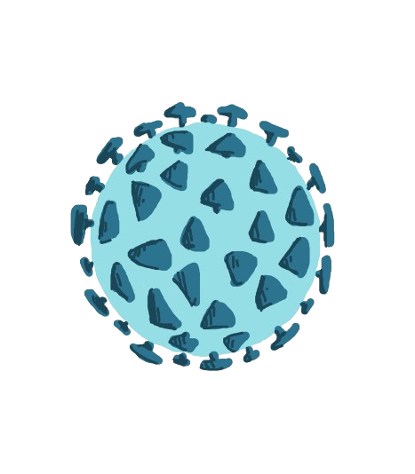

<section class="p2">
      <h1 class="respiratorio">Virus: Sistema Respiratório</h1>
      

        

          
          <button class="botao-corona">
            <a href="#">Corona Vírus</a>
          </button>
        

        

          
          <button class="botao-vsr">
            <a href="#">VSR</a>
          </button>
        

        

          
          <button class="botao-influenza">
            <a href="#">Parainfluenza</a>
          </button>
        

      

    </section>